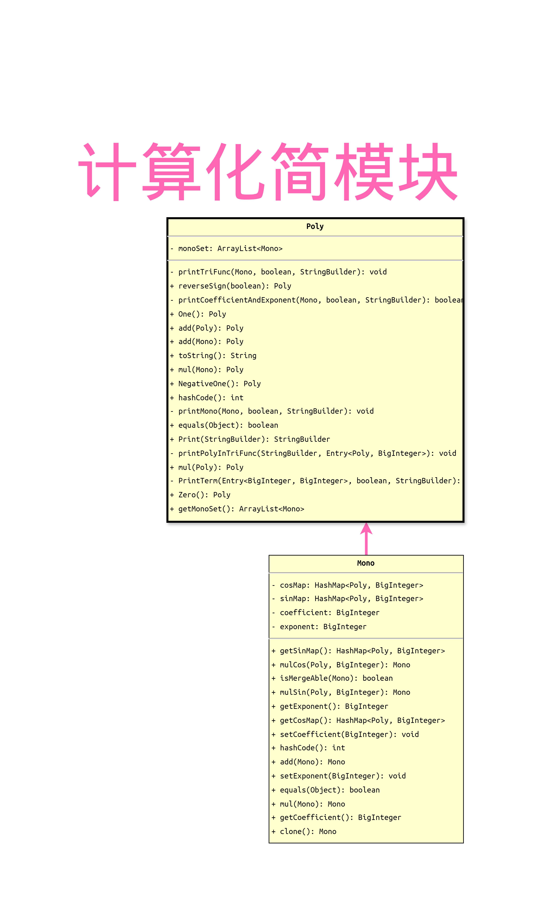
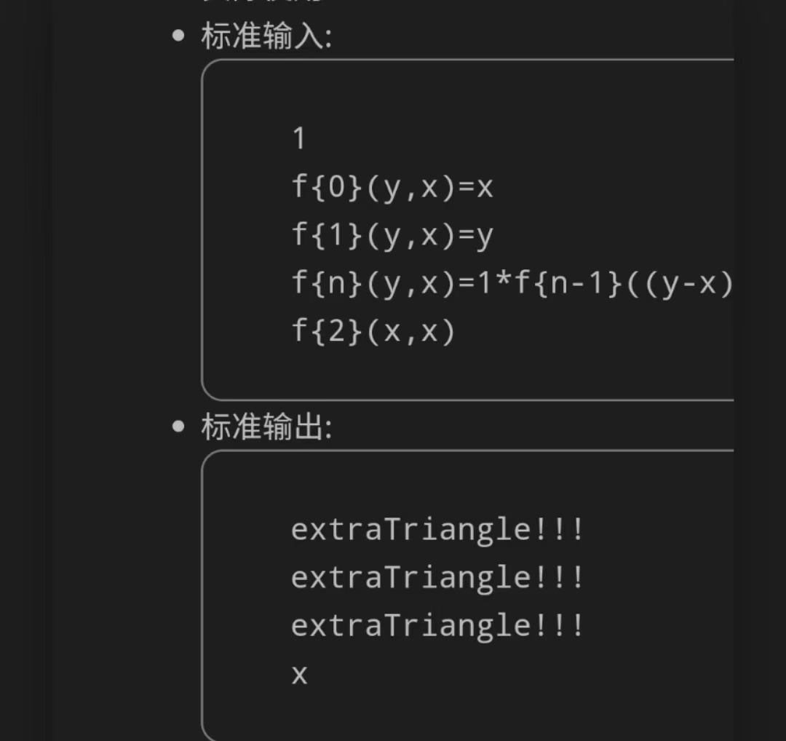

# 架构简介

在本单元中，作业要求我们对提供了**形式化表述**的复杂表达式进行**解析和化简**，并要求尽可能简短的输出以度量性能分数。

而经过三次作业迭代（其中包含一次重构），最终架构设计图如下：


核心处理部分在于递归解析模块的两个递归，在图中具体表现为两个圈。接下来介绍和分析各模块的结构。

## 主线处理


本模块是整个项目的主体部分，其中箭头含义表示流程顺序，不代表类的继承关系。主要流程呈现为main方法：

```java
String input = scanner.nextLine();  // 读入
Lexer lexer = new Lexer(input.replaceAll(" ", "").replaceAll("\t", ""));          // 词法解析
Parser parser = new Parser(lexer);  // 传入Tokens
System.out.println(parser  
    .parseExpr()                    // 语法解析
    .assign(null)                   // 赋值处理函数调用
    .toPoly()                       // 计算化简
    .Print()                        // 构造StringBuilder
    .toString());                   // 输出结果
```

这样类似**流水线**的设计的优点是显而易见的，我们只需写好每一模块，封装成**黑盒**，确保每一部分的程序正确性，就可以完整实现所需功能。

然而，见上面整体图可以看出，除了实现核心功能的解析模块，其余部分的**耦合度**其实是偏高的。


我们会发现，`Lexer`, `Parser`, `Poly`这几个在主线中实现了相当一部分功能的类，因为把大量的**重复性**功能藏在一个类甚至一个方法内部实现（例如Lexer的大量if-else出现了控制分支数目大的问题），出现了耦合度过高、可读性差的问题。

举例来说，我们可以分析这个只由两个类实现计算、化简、简化功能的模块：

## 计算化简



这个模块内部实现了过多功能，方法个数多，方法规模大，只因它们都涉及到用于存储化简后输出结果的类——`Poly`（多项式）和`Mono`（单项式）——这就导致了这一部分难读、难拆、难拓展。

## 递归解析

而与之相对的，由于有先导课程的最后一次作业的架构作参考，这个采用递归下降法解析和存储的模块有相当良好的可拓展性和低耦合度。


这一模块的度量值相当良好，故省略去分析。这一部分的递归主要在于


1. `Expr` - `Term` - `<Factor> ExprFactor` - `Expr` （见橙色箭头）形成的环，该递归改编自先导课程作业代码。
2. `Expr` - `Term` - `<Factor> <VarFactor> FuncCall` - `<FuncDefine.exprs> Expr` 。这一递归赋值处理函数调用的思路详见我在第二次作业中的[讨论发帖](http://oo.buaa.edu.cn/assignment/608/discussion/1656)，当然，在非校园网环境下，你也可以[从此获取](https://oNya685.github.io/posts/BUAA/OO/Unit-1/homework-2-function/)。这一设计有极好的可拓展性，我们将在下一节进一步讨论。

# 迭代成型

## 第一次作业

通过采用先导课的递归下降设计，第一次作业的难点就主要在于计算与化简的部分了。此时我们埋下了直接导致需要重构的第一个雷，对于幂函数的处理，我没有完全参照形式化表述的思路，而是单独设计了一个类来表示幂函数，并于计算时再具体展开。

## 第二次作业

### 重构：形式化表述

重构前后的复杂度其实近似，故省去分析，但值得注意的是前后的架构设计：


其实都很明了，但最主要的区别其实是：**重构后的类的设计完全符合了给出的形式化表述**。第二次作业的迭代突然把形式化表述内容几乎翻倍不止，如果要沿着原来的架构像打补丁一样加上这大量的迭代内容，很可能最后根本写不完。

而重构后的迭代体验也大幅提升：我只需要无脑照抄形式化表述，就能写好解析器，设计好各个类，这不仅省下了时间，也直接跳过了大量与形式化表述不统一而可能引发的潜在的bug。

### 另一个大任务是递归函数调用的处理 

在得知该迭代需求后，我耗费了相当久的时间思考如何以合理、优雅的方式处理递归函数调用，最终设计的一套[处理思路](https://oNya685.github.io/posts/BUAA/OO/Unit-1/homework-2-function/)取得了相当好的**可拓展性**和相对低的耦合度，并结合**动态规划**和藏在其中的部分简化（例如，若某`ExprFactor`的`Expr`有且只有一个`Term`，该`Term`有且只有一个`Factor`，则该`ExprFactor`的简化方法返回该`Factor`，否则返回自身），实现了时间和空间上的大幅优化，并顺利解决掉了当`f{n}`的`n`过大时易爆栈的问题（事实上，事后发现课程组的Cost限制完全不足以超时或爆栈）。

## 第三次作业

虽说在第二次作业的互测里被打了不少次，理应来说，如果有继续迭代开发的需求，我会继续重构，并明确几点：

- 对象属性是否**可变**，会用到返回值的各种方法除了返回值之外应不应该产生**副作用**，会不会错误得**复用**某对象。
- 明确哪些类需要重写`hashCode()`和`equals()`，这一点对于优化性能得分至关重要。
- 耦合度过高的`Poly`和`Mono`是肯定要拆的，怎么**分解**而能继续实现原有功能，怎么设计更适合迭代的**架构**，怎么给优化性能留位置等。

但我并没有重构——第三次作业的需求很简单：

一是普通函数调用，我原设计的递归函数调用处理方法有相当的可拓展性，我甚至**没有修改函数相关的类**就轻松实现了该要求。

二是求导因子，但课程组给求导因子的限制过大，尤其是出现范围十分限定，因此我们只需在主线的流水线挑一个方便的环节（包括解析，运算，赋值，简化），附带上求导运算，就实现了。

所以为什么不重构？第二次作业虽然烂了点，但经过强侧和互测的检验，打完补丁就是能**保障正确性**的代码。重构意味着要重新面对潜在的bug，而在当前这一坨上作简单的迭代并没有显著难度，正确性也更有保障。因此，没有第二次重构。

# Bug分析

## 诡异的`HashMap`

这一bug并不是被测出来的：不解决这bug程序完全不能跑。这一单元里，大家都或多或少地与HashMap之类的容器或者hashCode等方法斗争了许久。至今我也不知道，除了新建一个容器往里塞，怎么遍历才能做到不报错。如果有下次，我可能选`.stream().map().collect()`。

## 完全符合形式化表述，但符合得不太完全

```
<递推表达式> → <常数因子> <空白项> '*' <空白项> <自定义递推函数调用n-1> <空白项> <加减> <空白项> <常数因子> <空白项> '*' <空白项> <自定义递推函数调用n-2> [<空白项> '+' <空白项> <函数表达式>]
```

虽然经过一次完全符合形式化表述的重构，但因为我的设计足以实现对函数调用的解析，所以我本以为递推表达式就是比较特殊的表达式，其实不然。这个`[<空白项> '+' <空白项> <函数表达式>]`的诡异的加号让`... + + + +1`这样的表述变成了可能。这一bug着实很坑，但也没有什么经验可总结。

## 谁会在`sin()`里套`sin()*sin()`？

本以为第三次作业大家都差不多，互测更是全房 0 Hack，应该不会有bug了……吗？


啊，输出了`sin(sin(...)*sin(...))`，但里面是一个表达式而非一个因子，所以应该是`sin((sin(...)*sin(...)))`。省去了不该省的括号。这个小bug从第二次作业互测测到第三次作业互测，都没有被测出来，第三次强测反倒测出来了，如果侥幸一点没测出来，这个bug可能永远都不会被发现了。

## 当然也有喜闻乐见的

最喜欢分析的bug是别人的bug，在此稍加分析有参考意义的两例。

### extraTriangle!!!



`extraTriangle!!!`一位没删用于调试的输出信息的同学如是喊道。

这一bug值得分析是因为教会了我们设计一个调试开关，例如：

```java
// MainClass.java
public Class MainClass {
	public static boolean debug() { return true; }
	...
	public static void main(String[] args) {
		if (MainClass.debug()) {
			System.out.println("Debug模式还没关，别看都不看就直接交了");
		}
		...
	}
}
```

### 可能复用的对象，`clone()`或谨防副作用

我用一个简单的函数，调用了`f{5}(x,x^2)`，就一次刀穿了三人（不过其中一人其实没错，他只是在喊`extraTriangle!!!`），仔细看看，竟与之前发现并修掉的bug如出一辙。有的时候，我们需要这个对象本身，有的时候，我们只是需要这个对象的值。

张三长大了一岁，无论是谁眼中的张三，都长大了一岁。有的时候，我们需要给张三拍照，把他当前的样子保留下来（或者是生成一个和当前的张三长得一样的克隆人）。问题就出在，可能A让张三长大了一岁，而B想给张三拍照时并没考虑到张三长大了一岁，拍下了不符合预期的照片。

我的解决方案是，A生成张三的克隆人，并把克隆人当成张三，后续让“张三”长大一岁，原来的张三就不会受到影响，B随时都可以给张三拍照拍到正确的样子。

# 测试策略

看源代码还是太折磨了，只有第一次作业读代码来设计测试用例了，后来都找不到用正则解析的了，大家处理思路十分趋同，与其看代码，不如直接构造各类极端样例，进行盲测了。

当然不能直接用互测窗口测，CD太长；也不能开八个IDEA窗口挨个输入，效率太低；首先将八个压缩包编译生成八个jar包，然后用命令行批量处理，用文件实现读写，最后把大家的答案扔进优化得最好最稳定的同学的jar包，就能得到格式统一的输出了。当然这是不够严谨的做法，我们也可以采取python的一些妙妙工具，把输出的字符串里的x直接文本替换成各种刁钻的数值，评判输出的纯数字结果是不是相隔很小即可（理论上结果应该一模一样，但三角函数优化和浮点数带来的误差不可避免）。

# 优化策略

前文已经提到了大部分的优化，因为实在无力处理三角函数的各种优化，且保住正确性分比贪性能分更稳妥。

现介绍前文未提到的两处优化：

## 重写`equals()`以合并同类项

与之对应的，我们也要重写`hashCode()`以实现在HashMap中能找到该同类项。

这样我们就可以应对括号内的值**存在关联性**的三角函数之间的合并了。

## 为返回值作顺带简化

例如前文提到的将`ExprFactor`返回其中仅有的`Factor`，可以一定程度上省去不必要的括号；又如`cos(0)`和`sin(0)`，可以直接返回具体数值。

# 心得体会

虽然第三次作业的轻松要求确实减少了我们的工作量，让我直接放弃了第二次的重构，但我仍没能理解普通函数调用为什么会放在递归函数调用之后作为新要求迭代。第二次作业的任务量也着实有些惊悚，不知是传统还是失误。

总的来说，第一单元在先导课提供了参考架构的基础上还算顺利，也能明显感到有所收获，期待第二单元的灵异电梯。