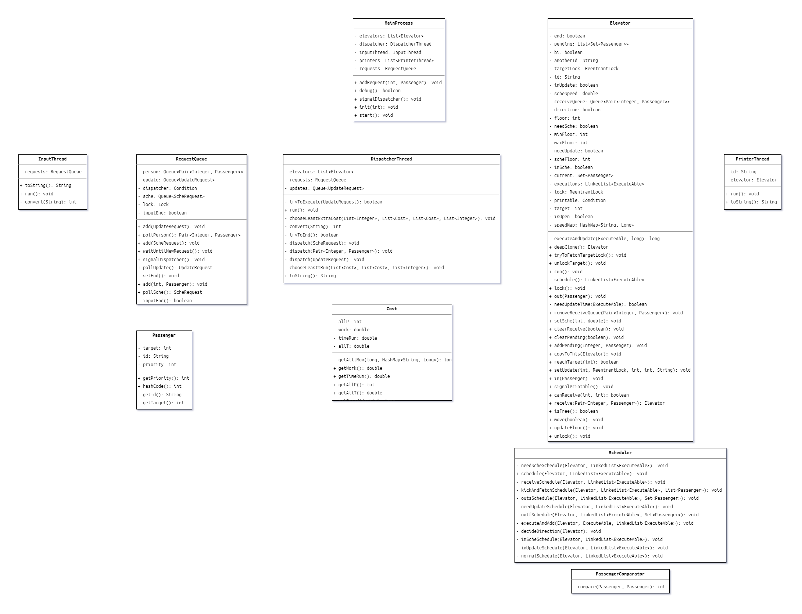
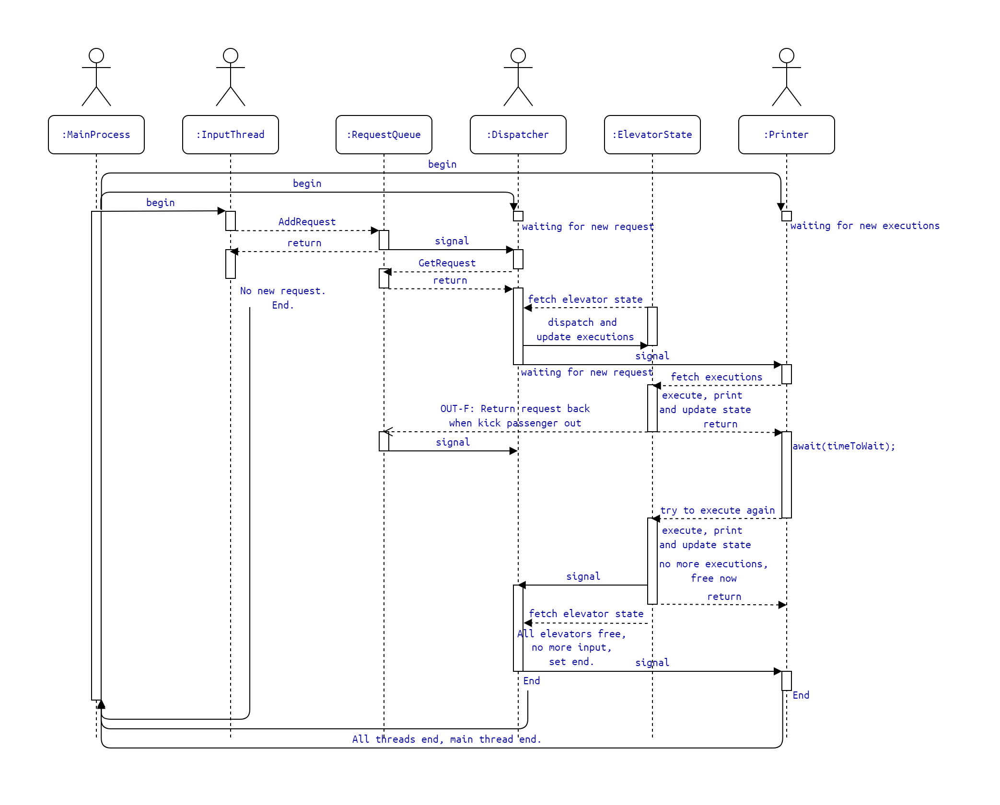

> 几千字的流水账真的会有人从头看到尾吗（？
> 
> 不按作业的要求顺序来了，有意思的放最前，重要的放其次，其余的往后排。

# 我们真的需要一台电梯么？

首先，回顾一下作业要求：我们要**模拟**六台电梯的运行、调度，和其开关门、移动、对乘客的接、送行为，其中大部分行为需要等待一定的**现实时间**。而评测要求我们在每一**状态转移完成**时输出一条信息，以供测评**评测机中模拟的电梯状态机**是否在**符合正确性规范**的前提下**完成功能**，并**评测性能**。

## 为什么是状态机

> **Everything is a state machine.**

经常上OS的同学都知道，状态机是一种表示可数个（我想表达的意思是，可以依据规律枚举、列举出，即使有无限种）状态以及在这些状态之间的转移和动作等行为的数学模型。

我们看该单元的电梯系统的架构设计：绝大部分同学（不如说难道还有用其他架构的吗）采取的是这样一种“**三段式架构**”：

$$输入线程 \rightarrow 请求队列 \rightarrow 分配器线程 \rightarrow 等待队列 \rightarrow 电梯线程$$

当然，根据大家设计的不同，可能还有其他的共享对象或者其他的箭头关系（主要取决于应对电梯踢人`OUT-F`和接受临时调度、Update等奇葩请求的设计）。

而电梯是如何决策其状态转移的呢？电梯有如下状态等：当前楼层，是否开门，等待（下称pending）队列，电梯内乘客队列（下称current）。在第一次作业我们就实现了这样一个状态机：采用ALS, LOOK, 或者其他的什么算法。我采用的是出于优先级考虑的，在**高覆盖率**的同时**降低加权平均等待时间**的改进的LOOK算法。

## `executions`的引入

那么，这一状态机的**输入**是什么？

回顾我们的架构设计，理所当然的，我们会说：输入当然是分配器分配给该电梯的等待队列，吗？

事实上，其决策并**不依赖输入**，换言之，并不是只有有新的请求时电梯才会动的。即使没有请求，电梯也会把自己唤醒，逐步更新自己的状态，直到回归pending和current都变为空的状态。

也就是说，**在任一时刻，若假定该状态机不再会有新的输入（不再分配新的请求），那我们就能推演出该状态机的后续所有行为。**
	所以，在后文中，我们暂且规定，称“状态机”为这种没有输入的，自动决策状态转移的状态机。
	有没有很像上学期计组做的那个CPU，把机器码记录在文件中加载出来，就能自动执行状态转移？如果把CPU和记录机器码的存储设备框在一起，而不认为机器码是一种输入。把机器码比作pending和current中的数据，和这一单元的电梯是不是很像？

那我们还该如何定义“分配新请求”这种行为呢？很简单，每次分配了新请求，或者告诉电梯要进行SCHE或UPDATE时，我们可以重新计算一遍该电梯从当前状态作所有决策，直到回归空闲状态这一区间中，**所有的状态转移**，并将其更新给电梯线程，电梯线程依次执行即可。

这里，我们引入一个队列 `LinkedList<Executeable> executions`。用以存储当前电梯所有的状态转移行为，依次执行完就可以抵达名为空闲的终点。

> Interface Executeable，要求实现方法execute(Elevator elevator);  执行时实现状态转移，更新电梯的当前状态

## 解构一台电梯

我们实现了对电梯这一对象的逐步**解构**：现在你还可以坚持称电梯线程在**模拟一台电梯**，实际上它在做的事情只有：**计算executions，execute执行，或者当时间条件不满足时await()**。

下述是对该电梯完全解构的最后一步：把计算executions的工作交给分配器

为什么要这么做？这么做有什么好处？我们考虑分配器的如下分配策略：

- 分配器现在需要**分配某乘客请求**给六台电梯中的任一台，如果可以的话，它希望知道**分配给具体哪一台电梯**能获得最优性能。（当然，不可以的话，随机挑一台塞进去也不是不能跑）
- 既然对分配器想要分配的这一时刻来说，每一台电梯的接下来的所有行为都是已知的，那么每一台电梯接下来的行为可以用以计算其成本。
- 那么，分配器想知道分配给哪一台电梯能让总成本最低，就会**依次尝试把乘客请求分配给其中某一台电梯**的情况，并希望知道其总成本：这样，**选出总成本最低的一种情况**，不就是局部的、已知的最优策略了么。相当于在若干条时间线，选了最完美的一条。
- 但是，怎么知道每一台电梯接下来的行为，甚至是，每一台电梯在接受了当前乘客请求的这一IF线下，接下来的行为呢？我们刚才已经讨论过了，**既然是状态机，那么必然是可以计算的**。
- 把电梯线程叫醒帮自己计算看上去不太现实（事实上也不太现实），那就自己计算吧，把六个状态机的状态拷贝一份，再创造六个接受了当前乘客分配的IF线状态机，选出最好的一条IF线，并拿这个IF线状态机替换掉真正的状态机，狸猫换太子，就实现了最优分配策略。
- 那，算都算完了，电梯线程偷个懒不算了，拿着分配器算好的executions，**到时间就执行并且输出**就好了。

## 影子电梯：但是只有影子电梯

至此，这一臃肿的、模拟真实电梯运行的线程的工作，只剩下：维护一个状态已知、接下来所有状态转移已知的状态机，到了时间就给状态机**执行一步状态转移并输出**，没到时间就回去等着。

> 那么，电梯还存在吗？或许游离于分配器的心中，或许藏匿于状态机的状态里，又或许**闪烁在评测机的眼中**，反正不可能说它存在于电梯线程的模拟中了，这么说电梯线程也不能答应的，它只是拿着一串executions，到时间就输出出来而已，连execute都是封装好的。所以我称这样的“电梯线程”为`Class Printer extends Thread`，它就是一台到时间就自动打印的打印机而已。

> 按道理来说，贴代码是没人有心思看的，自己的代码自己迭代时都懒得读，但是这是这个线程所剩下的全部内容了，还是读一下吧？
> 为可读性优化和简化了部分，所以算伪代码。

```java
public void run() {  
    long lastTime = System.currentTimeMillis();  
    lock.lock();
    // 为方便读，这里省掉了await的try-catch包装块。
	while (true) {  
		ExecuteAble execution = null;
		// 瞬间的行为，循环依次完成。
		while (!executions.isEmpty()) {  
			execution = executions.getFirst();  
			if (needTimeToExecute(execution)) {
				break;
			}
			lastTime = executeAndUpdate(execution, lastTime);  
		}
		// 空闲状态，尝试结束或等待新任务的分配。
		if (executions.isEmpty()) {  
			if (end) { break; }  
			MainProcess.signalDispatcher();  
			printable.await();  
			continue;
		}
		// 非瞬间行为，判断是否满足执行条件，失败则等待。
		long timeToWait = lastTime  
			+ needTimeMap.get(execution)  
			- System.currentTimeMillis();  
		if (timeToWait <= 0) {
			lastTime = executeAndUpdate(execution, lastTime);  
		} else {
			printable.await(timeToWait, TimeUnit.MILLISECONDS);  
		}
	}
    lock.unlock();
}
```

于是，我们实现了所谓**影子电梯**，证明了影子电梯的可行性，但是全部都是影子电梯。与其说分配器是通过影子电梯计算出分配给具体哪一台真正的电梯，不如说分配器是**拿一台更新后的影子电梯换掉了原来的影子电梯**。

# 既然影子电梯可行，如何适应性能指标？

现在谈谈该调度策略是如何权衡总时间、加权平均时间和电量的：

1. 首先，我们要尽量降低**总时间$T_{run}$**：这一性能指标显然比另外两个重要的多，如果为追求低功耗而$T_{run}$过大，我们甚至会被判断为效率太低而**超时**，而平均分配、随机分配等方法，也都是在**放弃对于加权平均时间和功耗的考量**下，追求$T_{run}$的解法。

但是，$T_{run}$有两个特性：
- 一是对于所有电梯来说，**只有最大的$T_{run}$是有意义的**，当其中一台电梯的总时间很长，而给其他某台电梯分配了请求后总时间依然不比最长的总时间长，那么$T_{run}$是没有变化的，此时追求降低$T_{run}$是一种没太大意义的行为。
- 二是对于当前$T_{run}$最大的电梯来说，**捎带请求是一种以牺牲少量$T_{run}$换取极大加权平均时间和功耗上收益的决策**。代价是你需要花额外0.4s的$T_{run}$在这一层停下并开关门，性能上却相当划算。

因此，在六台电梯分别接受分配请求的时间线中，我选出所有接受分配请求后，$\Delta T_{run} \leq 1s$的时间线并纳入考虑，如果没有符合条件的，则选出$T_{run}$增加值最小的一种情况直接作为分配结果。

接下来我们就可以不考虑$T_{run}$对性能的影响了，即使还有影响，也不到1s，可以大致忽略。我们要考虑，经过筛选后的若干种情况里，加权平均时间$wT$和功耗$W$综合最优的一种情况。但由于性能分是与同学们排名后计算的，我并不知道怎样取得综合最优，理论上我们需要满足：

$$\begin{align*}
\Delta \text{cost} &= a \Delta wT + b \Delta W, \quad a + b = 1 \\
\begin{pmatrix} a & b \end{pmatrix} &= \arg\min \Delta \text{cost}
\end{align*}$$

我取$\begin{pmatrix} a & b \end{pmatrix} = \begin{pmatrix} \frac{10}{10+1} & \frac{1}{10+1} \end{pmatrix}$，最后效果尚可。

# 双轿厢：线程协作是否应该影响对象行为？

我们已经论述过了，时间是线程（具体来讲，是`Printer`这一打印机线程）要考虑的，线程是**动态的、连续的**，共享对象只有状态，是**静态的、瞬间的**。

所以双轿厢电梯的行为，是共享对象所考虑的，同步开始改造和避免相撞却是线程所需保证的。

具体来讲，我们采取的策略是到达临界楼层后，通过锁等方式让协作线程若有需求先等待自己完成任务，自己完成后尽快退出临界楼层（当然该行为也是共享对象所存储的，而非线程唤起的），放还锁让协作线程继续动态行为。

而在同步改造方面：

- 当两电梯的下一execution均为`UPDATE-BEGIN`时，由分配器输出`UPDATE-BEGIN`并唤醒两打印机线程进入计时。两线程共享一把锁。
- 其中一台电梯`UPDATE-BEGIN`时锁上共享锁，`UPDATE-END`时先输出`UPDATE-END`，然后放还共享锁。
- 另一台电梯不输出，`UPDATE-BEGIN`时无行为，但`UPDATE-END`时先尝试拿到共享锁，拿到后立即放还，然后才执行自己的后续操作。
- 这样，我们就实现了两协作线程的同步。

在这一过程中，线程间的交互不对对象状态产生影响，只对状态转移的时间，即线程行为有所限制。故而，**线程协作不影响对象行为**。

> 接下来补充比较重要的内容。

# 架构设计



很明显能看出三段的设计：$线程-共享对象-线程-共享对象-线程$。

前文已介绍过该架构的工作流程，在第一次作业中，我采用与大家相同的架构，而在第二次作业的重构中，我将电梯线程的功能解构提取，变成了如上的只保留简单功能的`PrinterThread`。第三次作业中，无新增类。

值得介绍的是Scheduler类，其包装了该状态机的决策行为，也即其所有的状态转移计算过程。通过封装Scheduler，我们实现了电梯决策器的可拓展性：当我们需要更换、优化电梯算法，只需要换一个Scheduler或者继承原Scheduler即可。

> 这里给出一种性能优化思路，配备多种Scheduler，考虑每种电梯装载不同Scheduler，采取不同算法的时间线，并综合总的性能考量，返回给各状态机最优的executions。但该方法的计算量预估提升了一个数量级，为避免CTLE，应谨慎考虑。

# 线程协作


上图已明了介绍线程中的协作关系，此处详细解释最后的线程结束的判定：

- 首先，输入线程的结束条件很清晰：读取到值为`null`的请求时。
- 但对于Request Queue来说，输入线程与六个电梯线程同时作为生产者，分配器作为消费者；同时，对于每个电梯状态机，分配器是生产者，电梯线程是消费者。
- 这就形成了一个圈：分配器与电梯互为消费者和生产者，而生产者没有结束时，消费者自然不可以结束。
- 因此，我们重新定义电梯线程作为生产者的结束：当其executions为空，即空闲状态下，它自然不可能再放归新的请求，我们可以认为其处于临时的结束状态。
- 而对于此时的调度器，倘若没有需要分配的请求，其会尝试结束：
	- 输入线程已结束
	- 各电梯线程处于空闲状态
	- 也即对于RequestQueue，不会有新的生产，也因此没有消费行为和消费行为导致的新的生产。
- 此时调度器可以认为达到结束条件，结束自身线程并对后续所有线程设置结束。

> 有趣的和重要的均已结束，现在补充作业要求的其他内容。

# 易变的内容

稳定的内容已于上文完成分析，而易变的内容，我们需着眼分析两个“例外”：`SCHE`和`UPDATE`。

- 对于`SCHE`，我选择将`ScheBegin`和`ScheEnd`纳入`Executeable`范畴，将其视为状态机的正常状态转移行为，从而使其回归稳定的内容的体系；
- 对于`UPDATE`大体相同，但`UPDATE-BEGIN`实在太特殊，为了两电梯之间的同步，我将其设置为电梯的一种新的状态并因此补充了大量特判，这也是引发我bug的直接原因：补丁没打全。

# Bug分析与Debug方法

第一二次作业无bug，对第三次作业的`UPDATE-BEGIN`处理引发了第三次作业的bug，并直接导致了强测爆炸：

对于`UPDATE-ACCEPT`前分配给电梯的请求，经过改造后并不一定能接受，因为其所在楼层不一定属于自己所能移动的范围内。而为了避免`UPDATE`和`SCHE`之间无法`RECEIVE`请求导致分配器轮询，我为每个电梯配置`RECEIVE`请求缓存区，囤积在`END`后再输出，因此错过了`UPDATE-BEGIN`时清空当前已`RECEIVE`请求的机会，从而可能`RECEIVE`改造后无法处理的请求。

改正方法为：`UPDATE`开始时清除`RECEIVE`缓存区中自己改造后无法处理的请求。

Debug方法为输出。当debug模式启用时，输出各关键行为前后的线程状态、状态机状态。

```java
// MainProcess.java
public static boolean debug() { return false; }
```

> 虽然本次作业没有要求课程建议，但是实在很想建议：
> 
> 能不能给一个`TimableOutput.debug(String string)`然后输出内容不计入评测，只供debug时便于人类查看，间接解决掉评测出的bug在本地无法复现的问题？这样只要写好关键步骤的日志，就能快速定位到bug，即使本地无法复现也可以正常修复？

# 线程安全与层次化设计

1. **锁的合理使用**
   - 在本次作业中，线程安全是至关重要的。尤其是在处理多线程的电梯调度和状态更新时，锁的使用非常关键。例如，在电梯线程和分配器线程之间共享的状态机状态（如电梯的当前楼层、电梯内乘客队列等）必须通过锁来保证线程安全。
   - 我们使用了`ReentrantLock`来确保在更新状态时不会出现竞态条件。例如，在电梯线程执行状态转移时，需要对`executions`队列进行操作，此时必须加锁，防止分配器线程同时修改该队列。同时，锁的使用也需要谨慎，避免死锁的发生。在电梯线程和分配器线程之间，我们通过合理的锁顺序和锁的释放时机来避免死锁。
   - 使用`ReentrantLock`有什么好处？条件管理更灵活，而且锁可以脱离对象或代码块而存在，请看使用了`ReentrantLock`的影子电梯的名场面**六把锁**：
```java
   elevators.forEach(Elevator::lock);
   // 计算与分配
   elevators.forEach(Elevator::unlock);
```
2. **线程间通信的同步机制**
   - 线程间通信的安全性也是线程安全的重要方面。在本次作业中，电梯线程和分配器线程之间通过`executions`队列进行通信，而这个队列的更新和读取必须是线程安全的。
   - 我们使用了`Condition`来实现线程间的同步。例如，当电梯线程处于空闲状态时，它会调用`await()`等待分配器线程的信号。分配器线程在计算出新的`executions`后，会调用`signal()`唤醒电梯线程。这种同步机制确保了线程间通信的正确性和及时性。
   - 同时，在处理双轿厢电梯的**同步**（改造期间）与**互斥**（临界楼层）时，我们通过共享一把`ReentrantLock`来实现两台电梯线程之间的同步。这种同步机制不仅保证了线程安全，还避免了电梯之间的冲突。
3. **架构设计的层次化**
   - 层次化设计使得代码更加清晰和易于维护。在本次作业中，我们将整个电梯系统划分为多个功能模块，每个模块负责特定的功能。
   - 例如，输入线程负责读取请求并将其放入请求队列；分配器线程负责从请求队列中取出请求并分配给电梯；电梯线程负责执行电梯的状态转移。这种模块划分使得每个线程的功能单一，便于理解和维护。
   - 同时，我们还引入了`Scheduler`类来封装电梯的状态转移计算逻辑。这样，当需要更换或优化电梯算法时，只需要修改`Scheduler`类，而不需要修改电梯线程的代码。这种层次化设计提高了代码的可扩展性和可维护性。